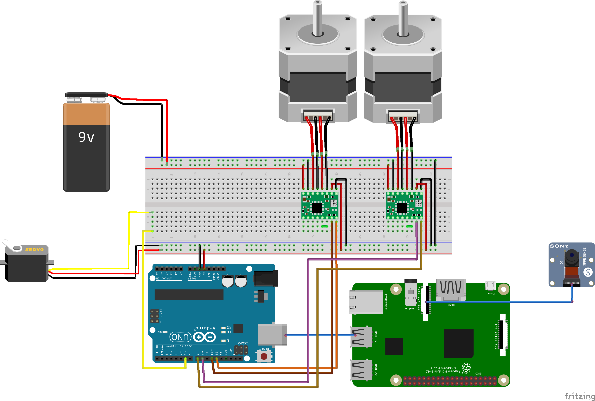
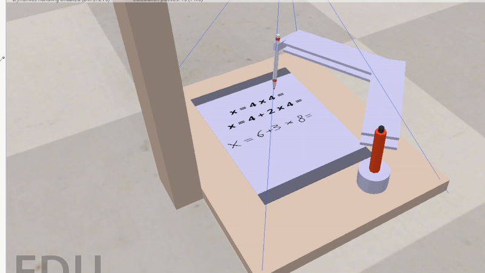

<a href=https://github.com/Dzen456/CalcUABlator>

</a>

<br>
<p style="text-align:center;">
A robot capable of doing mathematical operations using Computer Vision.

This document contains instructions of the robot's functionality and usage, and the requirements necessary for this code to work.
</p>
</br>

## Table of contents:

- [Directories](#Directories)
- [Installation](#Installation)
  - [Hardware](#Hardware)
      - [Fritzing](#Fritzing)
  - [Software](#Software)
- [Usage](#Usage)
- [Bibliography](#Bibliography)

## Directories:

CalcUABlator has the following directories:

- CoppeliaSim_CalcUABlator: This folder contains the CoppeliaSim of the robot, where you can simulate his behaviour and usage.
```cmd
CoppeliaSim_CalcUABlator/
├── test_texture/
│   └── test_texture.jpg
├── CoppeliaSim_CalcUABlator.ttt
├── CoppeliaSim_CalcUABlator_script.ipynb
├── remoteApi.dll
├── sim.py
└── simConst.py
```
- Fritzing_CalcUABlator: This folder contains the blueprints for the fritzing of the robot, required for his correct construction. The diagram must be followed; otherwise, the robot likely won't work.
```cmd
Fritzing_CalcUABlator/
├── calcUABlator-fritzing.fzz
├── calcUABlator-fritzing_bb.png
└── references.txt
```
- Old version - 3D Model and ideas: This folder contains an old, unused version of the robot for researching purposes, with the dimensions, list of components, and a code for the camera.
```cmd
Old version - 3D Model and ideas/
├── OLD_calcUABlator/
│   ├── background_test/
│   │   └── christmas_photo_studio_07_4k.exr
│   ├── Pen Holder/
│   │   │── Comment.txt
│   │   │── part1.png
│   │   │── part2.png
│   │   │── part3.png
│   │   │── part4.png
│   │   └── RLP_PenHolder.blend
│   ├── List of components (No Hardware) - 22-04-2025.pdf
│   ├── RLP_Robot_sketch2.blend
├── Measurement_Confirmation_Script.py
├── Raspberry_Structure_Measurements_Trigonometry (Comments in Spanish).pdf
└── Raspberry_Structure_Measurements.txt
```
- Software_CalcUABlator: This folder contains the function diagram of the robot, with all the variables and functions that the robot manages in the Raspberry Pi and Arduino modules. 
```cmd
Software_CalcUABlator/
└── SoftwareSchema.pdf
```

## Installation:

### Hardware

Making this robot requieres all of the following **hardware components**, or at least similar to:

| Arduino UNO 4 WiFi | Raspberry Pi 4 | 
| Source Power Supply for Raspberry Pi 4 - 5V/2.5A | Camera Raspberry Pi v2 - 8 Megapixels |
| Motor NEMA 17 / 3.5Kg with conector and cable (x2) | Stepper motor Drivers (A4988) (x2) |
| Standar servo S3003, 360 Degrees | ATX COOLBOX 500W |  

- Arduino UNO 4 WiFi
- Raspberry Pi 4
- Source Power Supply for Raspberry Pi 4 - 5V/2.5A
- Camera Raspberry Pi v2 - 8 Megapixels
- Motor NEMA 17 / 3.5Kg with conector and cable (x2)
- Stepper motor Drivers (A4988) (x2)
- Standar servo S3003, 360 Degrees
- ATX COOLBOX 500W

#### Fritzing:


Also, it is required to have the following **additional pieces**:

- Arms Support: (estimated parameters: length - 18 cm / width - 5 cm / thickness - 0.25 cm)
- Big Metal Axis: (estimated parameters: diameter - 2 cm / height - 12 cm)
- Big Axis Wheel: (estimated parameters: wheel diameter - 3 cm / hole wheel diameter - 2 cm)
- Small Metal Axis: (estimated parameters: diameter - 2 cm / height - 5 cm)
- Smal Wheel Axis: (estimated parameters: wheel diameter - 3 cm / hole wheel diameter - 2 cm)
- Screws: 20 screws of 1 cm, 4 screws of 3 cm
- Pen Support Piece: (estimated parameters: length - 5 cm / width - 1 cm / square zone hole - 1x1 cm)
- Wood Platform: (estimated parameters: length - 42 cm / width - 32 cm / thickness - 1 cm)
- Raspberry Structure Support: (estimated parameters: length - 8 cm / width - 8 cm / height - 30 cm)
- Raspberry Structure Superior Support: (estimated parameters: length - 30 cm / width - 8 cm / thickness - 2 cm)
- 2-4 brackets
- Rubber Strap
- Also some extra pieces between the arms and the axis supports.

### Software

If you just want to run the simulation, only CoppeliaSim software + Jupiter Notebook is required to make it work. 

For the Arduino UNO Rev. 3, you will need Arduino IDE.

## Simulation:

For the simulation, you just have to open and run the CoppeliaSim_CalcUABlator.ttt file on the CoppeliaSim and then execute the CoppeliaSim_CalcUABlator_script.ipynb notebook to activate the demo of the robot. It is possible to change the test texture in the folder test_texture to test the robot capacities.




## How to Use:

To run the robot's Arduino UNO Rev. 3, you'll have to connect the device to the arduino with a cable to be able to run the code correctly. You'll also need to build the robot using the components described above and the blueprints for the circuits and structure.

## Bibliography:

- https://raspberrypi-guide.github.io/electronics/camera-positioning
- https://docs.arduino.cc/tutorials/uno-rev3/getting-started/
- https://www.youtube.com/watch?v=wcLeXXATCR4
- https://www.wexterhome.com/curso-arduino/sentencia-if-else
- Robótica, Llenguatge i Programació class notes.
