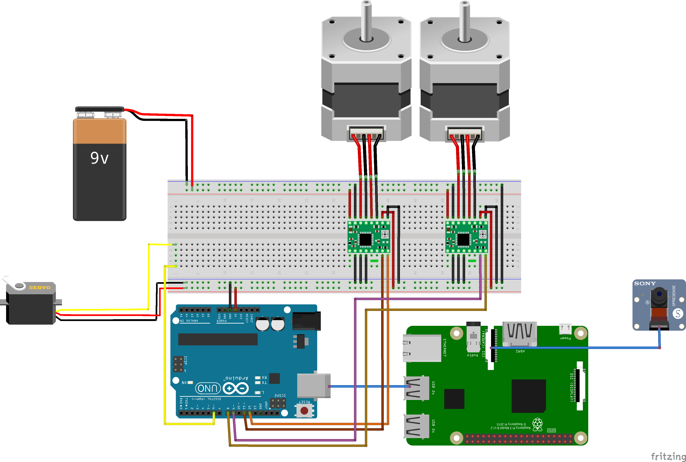

<a href=https://github.com/Dzen456/CalcUABlator>

</a>

<br>
<p style="text-align:center;">
A robot capable of doing mathematical operations using Computer Vision.

This document contains instructions of the robot's functionality and usage, and the requirements necessary for this code to work.
</p>
</br>

See <a href=https://github.com/Dzen456/CalcUABlator/blob/main/CREATIVE%20PROCESS.md> CREATIVE PROCESS </a> to read about the making of this project.


## Table of contents:

- [Directories](#Directories)
- [Installation](#Installation)
  - [Hardware](#Hardware)
      - [Fritzing](#Fritzing)
  - [Software](#Software)
- [Usage](#Usage)
- [Bibliography](#Bibliography)

## Directories:

CalcUABlator has the following directories:

- CoppeliaSim_CalcUABlator: This folder contains the CoppeliaSim of the robot, where you can simulate his behaviour and usage.
```cmd
CoppeliaSim_CalcUABlator/
├── test_texture/
│   └── test_texture.jpg
├── CoppeliaSim_CalcUABlator.ttt
├── CoppeliaSim_CalcUABlator_script.ipynb
├── remoteApi.dll
├── sim.py
└── simConst.py
```
- Fritzing_CalcUABlator: This folder contains the blueprints for the fritzing of the robot, required for his correct construction. The diagram must be followed; otherwise, the robot likely won't work.
```cmd
Fritzing_CalcUABlator/
├── calcUABlator-fritzing.fzz
├── calcUABlator-fritzing_bb.png
└── references.txt
```
- Old version - 3D Model and ideas: This folder contains an old, unused version of the robot for researching purposes, with the dimensions, list of components, and a code for the camera.
```cmd
Old version - 3D Model and ideas/
├── OLD_calcUABlator/
│   ├── background_test/
│   │   └── christmas_photo_studio_07_4k.exr
│   ├── Pen Holder/
│   │   │── Comment.txt
│   │   │── part1.png
│   │   │── part2.png
│   │   │── part3.png
│   │   │── part4.png
│   │   └── RLP_PenHolder.blend
│   ├── List of components (No Hardware) - 22-04-2025.pdf
│   ├── RLP_Robot_sketch2.blend
├── Measurement_Confirmation_Script.py
├── Raspberry_Structure_Measurements_Trigonometry (Comments in Spanish).pdf
└── Raspberry_Structure_Measurements.txt
```
- Software_CalcUABlator: This folder contains the function diagram of the robot, with all the variables and functions that the robot manages in the Raspberry Pi and Arduino modules. 
```cmd
Software_CalcUABlator/
└── SoftwareSchema.pdf
```

## Demo:

## Installation:

### Hardware

Making this robot requieres all of the following **hardware components**, or at least similar to:

| <a href=https://tienda.bricogeek.com/arduino-original/1845-arduino-uno-r4-wifi.html> Arduino UNO 4 WiFi </a>    | <a href=https://tienda.bricogeek.com/placas-raspberry-pi/1330-raspberry-pi-4-model-b-4-gb.html > Raspberry Pi 4 </a> |
| :------: | :------: |
| <a href=https://tienda.bricogeek.com/arduino-original/1845-arduino-uno-r4-wifi.html></a> | <a href=https://tienda.bricogeek.com/placas-raspberry-pi/1330-raspberry-pi-4-model-b-4-gb.html ></a> |
| <a href=https://tienda.bricogeek.com/accesorios-raspberry-pi/822-camara-raspberry-pi-v2-8-megapixels.html> **Raspberry Pi v2 Cam** </a>    | <a href=https://tienda.bricogeek.com/fuentes-de-alimentacion/775-fuente-de-alimentacion-atx-coolbox-500w.html> **Power Supply ATX 500W** </a> |
| <a href=https://tienda.bricogeek.com/accesorios-raspberry-pi/822-camara-raspberry-pi-v2-8-megapixels.html></a> | <a href=https://tienda.bricogeek.com/fuentes-de-alimentacion/775-fuente-de-alimentacion-atx-coolbox-500w.html></a> |
| <a href=https://tienda.bricogeek.com/motores-paso-a-paso/1360-motor-nema-17-35kg-con-conector-y-cable.html> **Nema 17 stepper** </a>    | <a href=https://tienda.bricogeek.com/controladores-motores/553-pololu-a4988-stepstick-prusa-reprap.html> **Stepper Driver Pololu A4988** </a> |
| <a href=https://tienda.bricogeek.com/motores-paso-a-paso/1360-motor-nema-17-35kg-con-conector-y-cable.html></a> | <a href=https://tienda.bricogeek.com/controladores-motores/553-pololu-a4988-stepstick-prusa-reprap.html></a> |
| <a href=https://tienda.bricogeek.com/motores/118-servomotor-de-rotacion-continua-s3003-360-grados.html> **Servo S3003** </a>    |  |
| <a href=https://tienda.bricogeek.com/motores/118-servomotor-de-rotacion-continua-s3003-360-grados.html></a> |  |

<!-- Source Power Supply for Raspberry Pi 4 - 5V/2.5A -->
- You will need to have a **Power Supply for the Raspberry Pi 4 of 5V/2.5A**.
- You should **use the +12V (Yellow output) from the ATX Power Supply** to power the stepper drivers.

- Maybe you should **calibrate the two stepper drivers to a VRef of 1.2V** (see how to do this in this video: https://youtu.be/wcLeXXATCR4?t=462):


#### Fritzing:


Also, it is required to have the following **additional pieces**:

- Arms Support: (estimated parameters: length - 18 cm / width - 5 cm / thickness - 0.25 cm)
- Big Metal Axis: (estimated parameters: diameter - 2 cm / height - 12 cm)
- Big Axis Wheel: (estimated parameters: wheel diameter - 3 cm / hole wheel diameter - 2 cm)
- Small Metal Axis: (estimated parameters: diameter - 2 cm / height - 5 cm)
- Smal Wheel Axis: (estimated parameters: wheel diameter - 3 cm / hole wheel diameter - 2 cm)
- Screws: 20 screws of 1 cm, 4 screws of 3 cm
- Pen Support Piece: (estimated parameters: length - 5 cm / width - 1 cm / square zone hole - 1x1 cm)
- Wood Platform: (estimated parameters: length - 42 cm / width - 32 cm / thickness - 1 cm)
- Raspberry Structure Support: (estimated parameters: length - 8 cm / width - 8 cm / height - 30 cm)
- Raspberry Structure Superior Support: (estimated parameters: length - 30 cm / width - 8 cm / thickness - 2 cm)
- 2-4 brackets
- Rubber Strap
- Also some extra pieces between the arms and the axis supports.

### Software


### Specs:

IDEs:
- Python (Pycharm, VS Code, Spyder,...)
- Jupyter Notebook 7+ (Downloaded from the website or Anaconda)
- Arduino IDE (Web or desktop version)

Other software:
- Coppelia 4.7
- Blender 4.1
- Python 3.11

### Requirements:
```shell
numpy
opencv-python
matplotlib
easyocr
sympy
pyserial
```

If you just want to run the simulation, see [Simulation](#Simulation). 

If you want to make it work in the real life, see [How to Use](#How-to-Use).

## Simulation:

1. Clone this repo.
 ```bash
 git clone https://github.com/Dzen456/CalcUABlator.git
 ```
   
2. For the simulation, you just have to open and run the CoppeliaSim_CalcUABlator.ttt file on the CoppeliaSim and then execute the CoppeliaSim_CalcUABlator_script.ipynb notebook to activate the demo of the robot. It is possible to change the test texture in the folder test_texture to test the robot capacities.


## How to Use:

1. Clone this repo.
 ```bash
 git clone https://github.com/Dzen456/CalcUABlator.git
 ```

2. Install the required libraries.
Using pip:
```bash
pip install requirements.txt
```
Using conda:
```bash
conda install -c requirements.txt
```

3. Execute python script in each directory.

4. To run the robot's Arduino UNO Rev. 4, you'll have to connect the device to the arduino with a USB cable to be able to run the code correctly. You'll also need to build the robot using the components described [above](#Hardware) and the blueprints for the [circuits](#Fritzing) and structure.

5. Add star to this repo if you like it!

## License:

This project has a <a href=https://github.com/Dzen456/CalcUABlator/blob/main/LICENSE> Creative Commons License </a>.

## Authors:

- Yanhao Lin
- Isaac Sánchez Amat
- Jofre Segura Montagut
- Raúl Velázquez Gómez
- David Zheng

## Bibliography:

- Arduino UNO R4 Wifi: https://tienda.bricogeek.com/arduino-original/1845-arduino-uno-r4-wifi.html 
- Raspberry Pi 4: https://tienda.bricogeek.com/placas-raspberry-pi/1330-raspberry-pi-4-model-b-4-gb.html 
- Nema 17 stepper: https://tienda.bricogeek.com/motores-paso-a-paso/1360-motor-nema-17-35kg-con-conector-y-cable.html 
- Power Supply ATX 500W: https://tienda.bricogeek.com/fuentes-de-alimentacion/775-fuente-de-alimentacion-atx-coolbox-500w.html 
- Stepper Driver Pololu A4988: https://tienda.bricogeek.com/controladores-motores/553-pololu-a4988-stepstick-prusa-reprap.html 
- Raspberry Pi v2 Cam: https://tienda.bricogeek.com/accesorios-raspberry-pi/822-camara-raspberry-pi-v2-8-megapixels.html 
- Servo S3003: https://tienda.bricogeek.com/motores/118-servomotor-de-rotacion-continua-s3003-360-grados.html


- Getting started with arduino: https://docs.arduino.cc/tutorials/uno-rev3/getting-started/ 
- Connect Raspberry Pi to Arduino: https://www.youtube.com/watch?v=xc9rUI0F6Iw 
- Connect stepper and stepper driver to Arduino (1): https://www.youtube.com/shorts/hTjXpgDDzUI 
- Connect stepper and stepper driver to Arduino (2): 
https://www.youtube.com/watch?v=nLV0fjUWI-g 
- Connect servo motor to Arduino: https://www.youtube.com/watch?v=rM1Zk05Xdlk 
- Connect Raspberry cam to Raspberry Pi: https://www.youtube.com/watch?v=VzYGDq0D1mw 
- Control stepper motor with Arduino: https://docs.arduino.cc/learn/electronics/stepper-motors/ 
- Control servo motor: https://docs.arduino.cc/learn/electronics/servo-motors/ 
- Connect, calibrate and control NEMA 17 steppers with arduino: https://www.youtube.com/watch?v=wcLeXXATCR4 
- Raspberry Pi v2 Cam angles: https://raspberrypi-guide.github.io/electronics/camera-positioning


- Robot from 2017: https://rlpengineeringschooluab2017.wordpress.com/2017/05/30/turing-drawing/
- Robótica, Llenguatge i Programació class notes.
